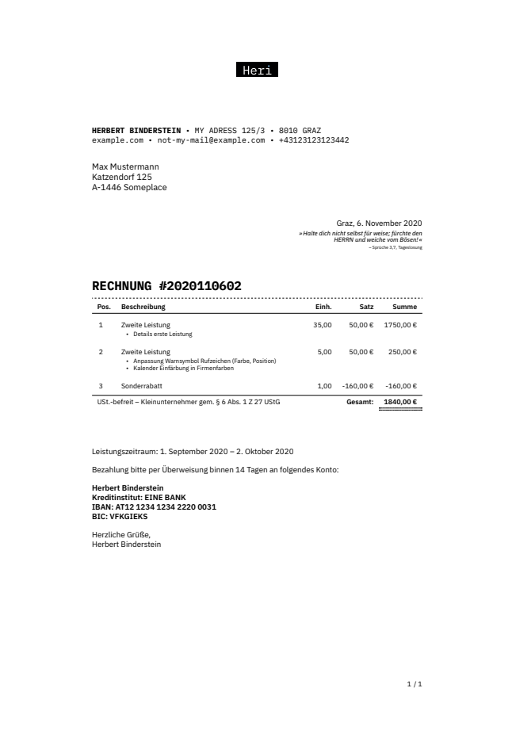
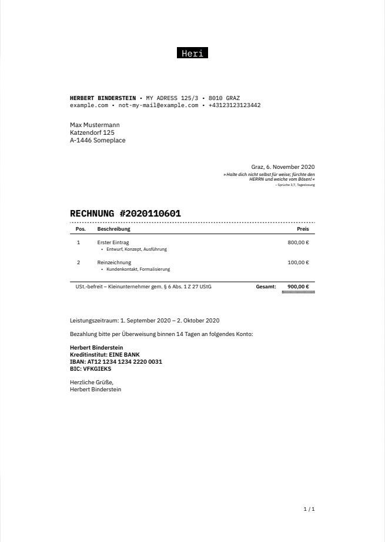
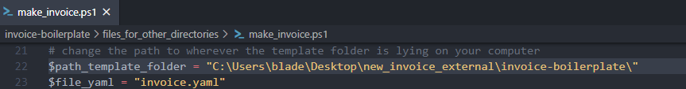

# Invoice Boilerplate

Simple automated LaTeX invoicing system for freelancers.

## Intro

For detils see original creation, of which this is forked.

I've built this for my personal use, but I quite extended it so I thought some changes might be interesting to some, so I now fake-forked it afterwards (I'm no coder and new to git, so I didn't handle my initial forking properly... I'm sorry `:-(` )

this template uses the IBM PLEX SANS and MONO, added some personal quirks, such as the possibility to include a bible verse, and made it possible to calculate rates... and adds the notice for small business use according to AUSTRIAN law.

see examples, there's the possibility to create invoices with rates and without rates:

I've written a powershell script that copies all necessary files to another directory, performs the pandoc tasks there, then removes the files. this seperates the templating from the content-work.

its in the "copy-to-your-working-directory" folder.

otherwise use the make.ps1 file or make.sh file, or write your own makefile.
I'm a programming noob and not a linux user, so I'm not familiar with makefiles yet... I just wrote a quick script in powershell, because that's what's easiest for me atm.

## Dependencies

1. LaTeX with the following extra packages: `fontspec` `geometry` `ragged2e` `spreadtab` `fp` `xstring` `arydshln` `hhline` `titlesec` `enumitem` `xunicode` `xltxtra` `hyperref` `polyglossia` `wallpaper` `footmisc`, **new**: , `array`, `tabularx`, also loaded currently but not actually in use in the document: `xcolor`, `graphics` and `graphicx`
2. [Pandoc](http://pandoc.org/), the universal document converter.

To install LaTeX on Mac OS X, I recommend getting the smaller version BasicTeX from [here](https://tug.org/mactex/morepackages.html) and installing the additional packages with `tlmgr` afterwards. Same goes for Linux: install `texlive-base` with your package manager and add the needed additional packages later.

To install pandoc on Mac OS X, run `brew install pandoc`. To install it on Linux, refer to the [official docs](http://pandoc.org/installing.html).

## Getting started, optimal workflow with powershell

1. The content is in the files "invoice.yaml" (here is example content, commented, but it should only include data that is the same for all your invoices!)
2. then change the .md file, best use those in the "files_for_other_directories" folder
3. copy these .md files somewhere where you want to have them and generate your pdfs
4. copy make_invoice.ps1 somewhere to your path
5. change the path in make_invoice.ps1 to the folder containing the template:
   
6. go to your working directory with your md file, run `make_invoice.ps1 myfilename.md` 

**Note**: this template needs to be compiled with XeTeX.

## use the files on linux and mac without powershell

you need to have powershell installed (default on windows 10) to use the script aforementioned, otherwise you can just use the make.sh script on linux and macOS, though i have not tested it. there's also `make.ps1` which does the same in powershell.

## Available settings

*not all are documented, UST-Befreit is for small businesses in austria, it provides the legally required notice for VAT-exemption*

- **`UST`**: your VAT rate, enables VAT calculation (but calls it UST for german/austrian UMSATZSTEUER)
- **UST-befreit**: adds notice for small businesses according to AUSTRIAN law.
- also new: for bible verses: `bible`, `verse`, `daily-verse`, `period`, extended `from` to `fromand` and `website`

- ALSO: i expanded the previous `service` with `rate-service`, see the `.md` files for proper use.

- **`currency`**: Your currency **in symbol, such as € or $**
- **`commasep`**: Set to `true` to use a comma as decimal separator. This is for display purposes only—remember to always use a dot to set the prices in your YAML file.
- **`lang`**: Sets the main language through the `polyglossia` package. This is important for proper hyphenation and date format.
- **`seriffont`**: Used for the heading and the sender address. Hoefler Text is the default, but every font installed on your system should work out of the box (thanks, XeTeX!)
- **`sansfont`**: Used to render the recipient address, the table and the closing note. Defaults to Helvetica Neue.
- **`fontsize`**: Possible values here are 10pt, 11pt and 12pt.
- **`geometry`**: A string that sets the margins through `geometry`. Read [this](https://www.sharelatex.com/learn/Page_size_and_margins) to learn how this package works.
- **`closingnote`**: This gets printed after the table as a closing note. Use it to provide your bank details and a thank you message.
- **`letterhead`**: include custom letterhead in the PDF (see below).

## Custom letterhead

If you have already designed your own letterhead and want to use it with this template, including it should be easy enough. Set the `letterhead` option to `true` to activate the `wallpaper` package in the template. `wallpaper` will look for a file named `letterhead.pdf` in the project root folder and print it on the PDF before compiling the document. Change the fonts to match the ones in your letterhead, adjust the margins with `geometry` and you should be all set.

## Recommended readings

- [Typesetting Automation](http://mrzool.cc/writing/typesetting-automation/), my article about this project with in-depth instructions and some suggestions for an ideal workflow.
- [Grids of Numbers Recommendations](http://practicaltypography.com/grids-of-numbers.html) on Butterick's Practical Typography
- [Multichannel Text Processing](https://ia.net/topics/multichannel-text-processing/) by iA
- [Why Microsoft Word must Die](http://www.antipope.org/charlie/blog-static/2013/10/why-microsoft-word-must-die.html) by Charlie Stross
- [Word Processors: Stupid and Inefficient](http://ricardo.ecn.wfu.edu/~cottrell/wp.html) by Allin Cottrell
- [Proprietary Binary Data Formats: Just Say No!](http://www.podval.org/~sds/data.html) by Sam Steingold
- [The Beauty of LaTeX](http://nitens.org/taraborelli/latex) by Dario Taraborelli

## Resources

- Refer to [pandoc's documentation](http://pandoc.org/MANUAL.html#templates) to learn more about how templates work.
- If you're not familiar with the YAML syntax, [here](http://learnxinyminutes.com/docs/yaml/)'s a good overview.
- If you want to edit the template but LaTeX scares you, these [docs](https://www.sharelatex.com/learn/Main_Page) put together by ShareLaTeX cover most of the basics and are surprisingly kind to the beginner.
- Odds are your question already has an answer on [TeX Stack Exchange](https://www.sharelatex.com/learn/Main_Page). Also, pretty friendly crowd in there.
- Need to fax that invoice? Check out [Phaxio](https://www.phaxio.com/) and learn how to send your faxes from the command line with a simple API call.

## See also

- [cv-boilerplate](https://github.com/mrzool/cv-boilerplate) — Easing the process of building and maintaining a CV using LaTeX
- [letter-boilerplate](https://github.com/mrzool/letter-boilerplate) — Typeset your important letters without leaving your text editor

## License

for original document, the license is:

[GPL](http://www.gnu.org/licenses/gpl-3.0.txt)

the licensing for this document so far isn't stated, but it is as restricted as allowed by the initial GPL license, for as long as I haven't read and made this whole repo actually nice and useable.